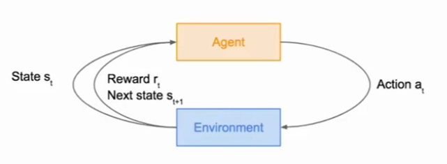
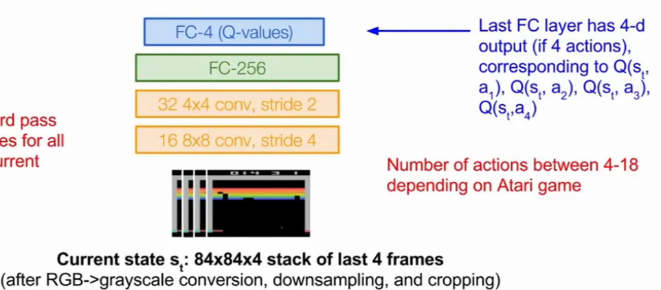
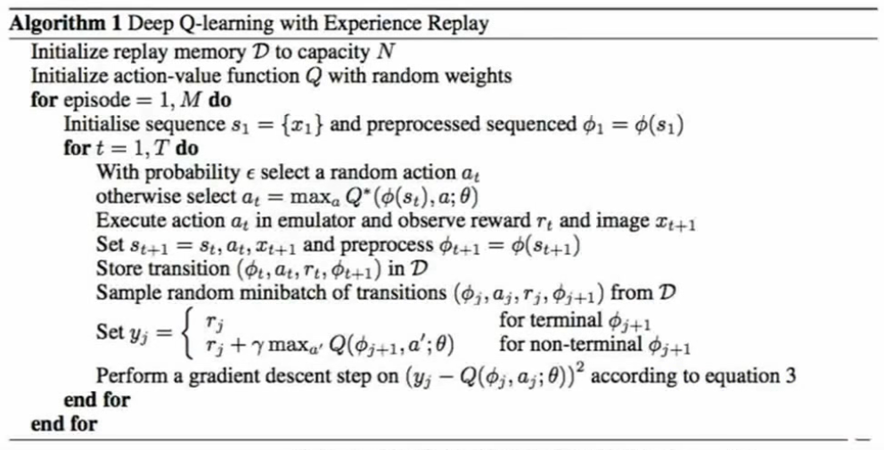
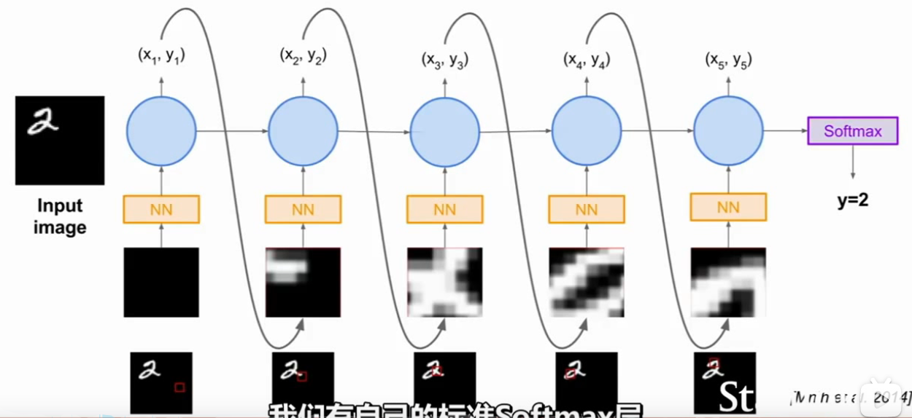

参考：
 - [课程官网](http://cs231n.stanford.edu/)
 - [视频](https://www.bilibili.com/video/BV1nJ411z7fe?p=31&vd_source=e7ba1b5c6c81d48eeecd2099401b1614)

<iframe src="//player.bilibili.com/player.html?aid=77752864&bvid=BV1nJ411z7fe&cid=133013576&page=31" scrolling="no" border="0" frameborder="no" framespacing="0" allowfullscreen="true"> </iframe>
 - 

## 引言

定义--->markov决策--->Q-Learning/policy-gradient

例子：
- 立柱问题
- 机器人运动
- atari game
- 围棋
 

## 马尔可夫决策

### 过程
抽样--->代理采取行动--->得分--->进入下一个状态--->循环

### 目的
寻找得分最高的行动组合

### 例子
MDP（好像是两点间路径规划，）每一步得分取负数

####    问题：处理MDP中的随机性？
（pi*为所有策略pi中最高分的那个）

Q-value function表示在状态s时采取行动a获得的奖励得分。Q*为最佳Q的和。`使用bellman方程完成 值迭代算法，强化bellman方程改进对Q星的近似。`
(这一块没听太懂，个人感觉比较类似算法中的动态规划/贪婪算法)

缺点：不可扩展--->函数逼近器（神经网络等）

## Q-learning

使用函数逼近器估计动作值函数。

### 例子 atari

#### 目标
得到最高分

#### 输入
原始像素 

#### 输出
前后左右指令

#### 实现

Q-function和loss funtion仅列出表达式，确实看不懂：
$$ Q^*(s, a)=\mathbb{E}_{s^{\prime} \sim \mathcal{E}}\left[r+\gamma \max _{a^{\prime}} Q^*\left(s^{\prime}, a^{\prime}\right) \mid s, a\right] $$

$$ L_i\left(\theta_i\right)=\mathbb{E}_{s, a \sim \rho(\cdot)}\left[\left(y_i-Q\left(s, a ; \theta_i\right)\right)^2\right] $$

经验回放：

样本之间相互关联--->低效学习--->不好的反馈循环--->对过度样本抽样，而非使用连续样本

#### 伪代码

#### 问题
Q-learning函数形式太过复杂--->policy gradient选择较为简单的策略

## policy gradient
### 数学原理
是真的一点都没听懂
### 例子： recuurrent attention

#### 目标
选取图像的重点区域 并完成图像分类 

#### state
当前扫描过的图片区域

#### action
接下来要选择的图像区域的中心坐标（x，y）

#### 网络结构

解决问题的能力非常依赖于网路的设计。

