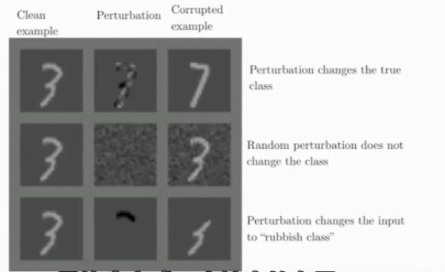

参考：
 - [课程官网](http://cs231n.stanford.edu/)
 - [视频](https://www.bilibili.com/video/BV1nJ411z7fe?p=33&vd_source=e7ba1b5c6c81d48eeecd2099401b1614)

<iframe src="//player.bilibili.com/player.html?aid=77752864&bvid=BV1nJ411z7fe&cid=133014498&page=33" scrolling="no" border="0" frameborder="no" framespacing="0" allowfullscreen="true"> </iframe>

# 硬件

## 引言
深度学习发展带来的问题：
- 模型规模
- 训练速度
- 能耗比

## 硬件基础知识

### CPU+GPU
cpu单线程（一头大象） gpu吞吐量导向（一群蚂蚁）

### FPGA+ASIC

---
选择16位/32位表示数据有较为优秀的能效比。（16>32)

## 算法

### 修剪

因为并非所有参数都有用，可选择性去掉冗余连接，并重复迭代训练。

训练--->剪枝--->训练剩余参数--->循环

此操作会改变参数的分布

### 权值共享

将权重聚类，用聚类中心表示权重值，防止过拟合并减少内存消耗

梯度下降过程会对权重中心产生微小的调整

### 哈夫曼编码

用较短编码表示较常出现数字减少存储消耗

### 量化

表示数字所用的存储位数不同。在一定范围内，减少表示数字所用的存储位数并不会导致网络性能大幅下降。

### 低秩近似

将一个卷积拆分成两个较小的卷积/在全连接层使用SVD分解将一个矩阵分解成两个矩阵--->加速

### wingrad转换
减少矩阵乘法实现时，简单乘法的运算次数

## 推断

### TPU

有较大的cache，大量的乘法运算单元

相较于CPU、GPU，TPU的存储带宽更大

瓶颈：存储带宽--->运算性能

## 训练

### 并行化
发展现状：
- 单线程能力发展趋于瓶颈
- 内核数增加

--->数据并行：从节点各自训练一组数据，然后将梯度传给参数服务器

--->模型并行：将模型拆分，分别传给不同的处理器/线程（类似算法课程中矩阵乘法复杂度下降的改进方法）

### 混合精度

混合使用float16和float32数据类型

- 16位精度：乘法

- 32位精度：加法、存储

使用此方法精度会稍微下降一丢丢

### 模型蒸馏

使用大型有效的模型教学生模型，是学生模型有较为优秀的表现。

--->使用多个大型有效的网络结果获得的软标签（soft label）训练学生模型

（Dense-Sparse-Dense模型)

## 硬件

### GPU

Tensor Core:实现4x4矩阵的混合精度乘法。

适用于：科学计算、图形计算、AR\VR
...

# 对抗样本和训练

认知流程：

- 过拟合--->发现不同的网络很容易对同一个对抗样本产生同样的错误分类结果--->过拟合观点错误
- 欠拟合（对距离分割平面较远的样本有很高的置信度） 

## 对抗样本生成

--->避免出现顶端、底端这样的极端情况--->快速梯度符方法FGSM--->成功率约99%