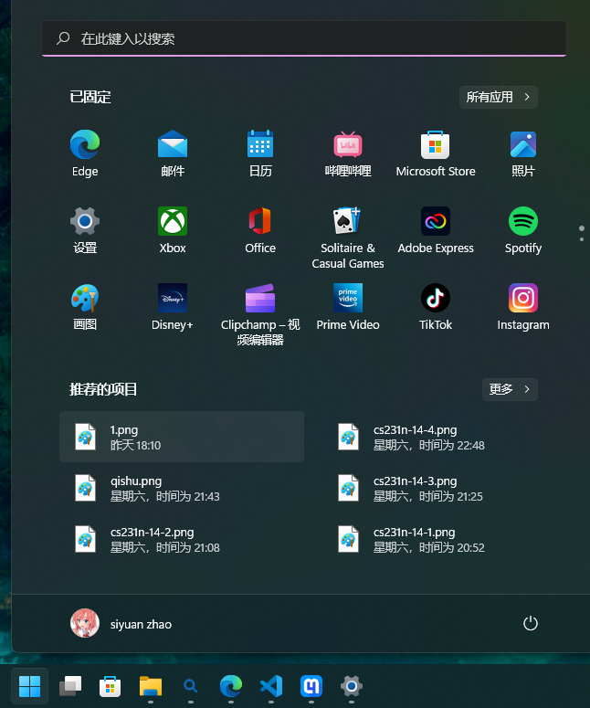
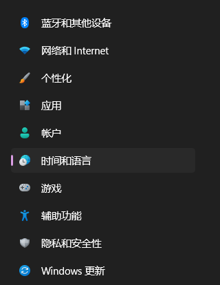
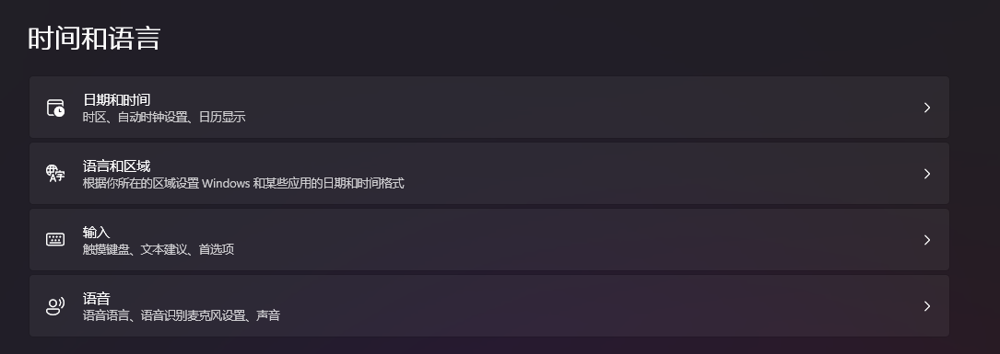
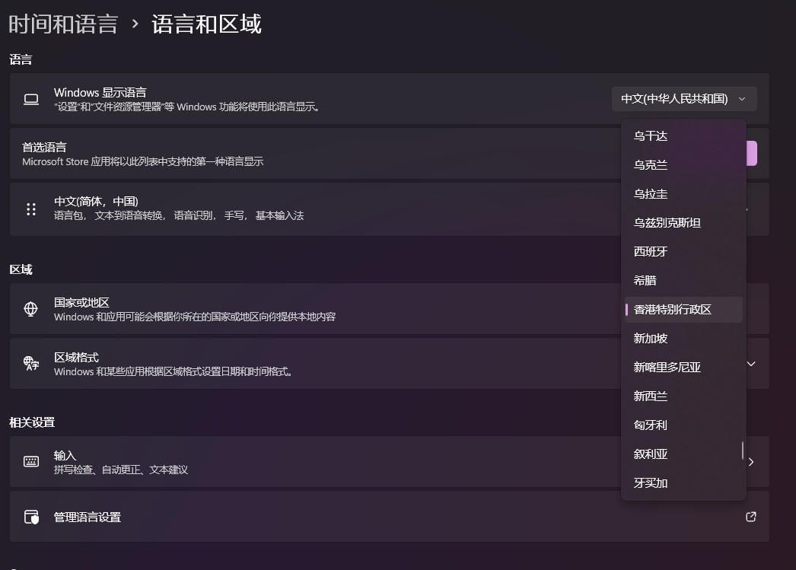
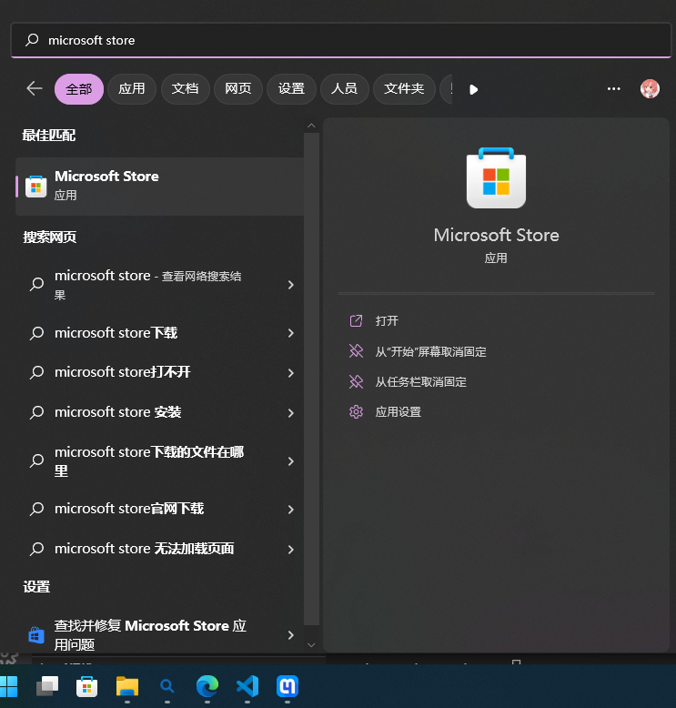
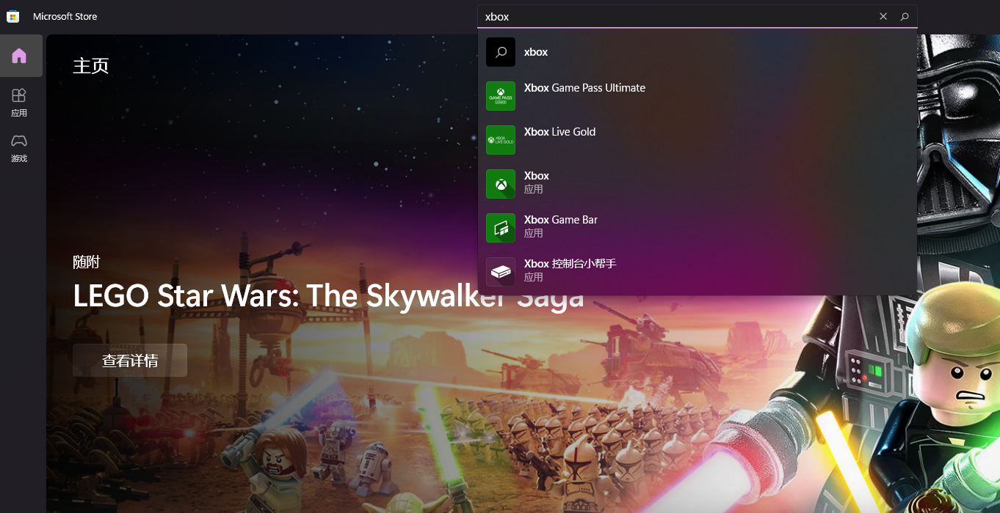
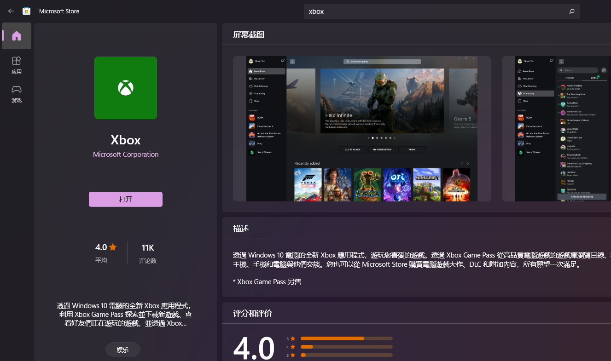
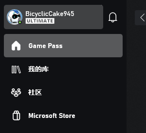
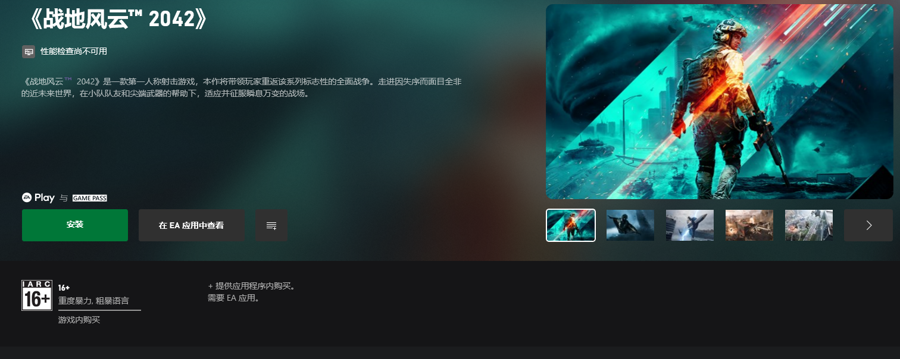



使用设备：
- win11 PC

## 更改电脑地区

- 打开**设置**：

- 在右侧选择**时间和语言**

- 选择**语言与区域**

- 在**国家与地区**处选择**香港**或**美国**

- 保存并退出

## 下载xbox应用

- 在开始界面搜索**microsoft store**并打开

- 搜索**xbox**

- 找到xbox应用并选择安装（我已经安装好了所以是打开）

- 验证：打开Xbox应用并登录，若界面左上角出现了game pass字样，则成功完成xbox安装。

## xbox game pass购买

 **请在淘宝搜索 xgp** ，参照商家的文档完成充值

### 主流充值方式对比

| 充值方式      | 优点 | 缺点    |
| :---:       |    :----:   |          :---: |
| 商家代充        | 价格较低、操作简单       | 将微软账号发给商家、有一定风险  |
| 自行兑换   | 需要Paypal账号、操作复杂        | 安全      |

## 安装游戏

在xbox应用中找到想玩的游戏，点击**安装**即可

