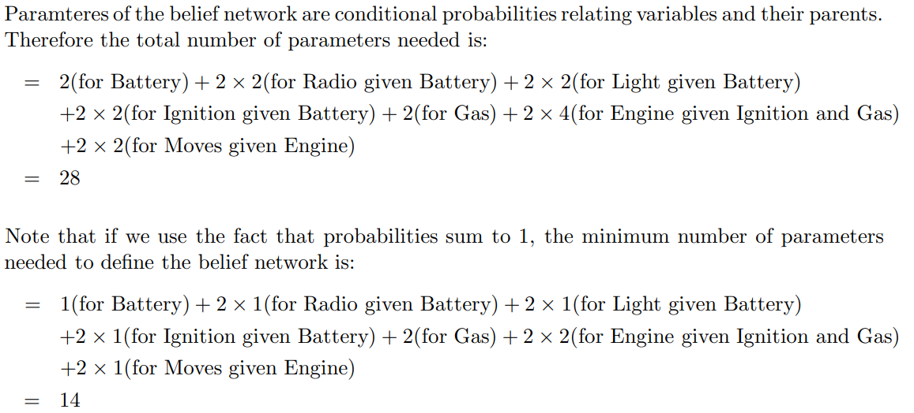

# 要求
- 第一章基本概念 
- 逻辑推理自然语言翻译命题逻辑和一阶逻辑
- 任意形式逻辑表达式转换为CNF
- 消解反证法证明定理
- 贝叶斯网路D分离
  [参考](https://zhuanlan.zhihu.com/p/274314301)
- 贝叶斯网络联合概率求其他事情
- prolog填空题（弄懂那个例子就行）
  
  [参考1](https://www.cnblogs.com/jiading/articles/12192564.html)(那个图画的不错，但不知道对不对) [参考2](https://www.cnblogs.com/lcomplete/p/3192488.html)
- 神经网络 一张图 
  [参考1](https://zhuanlan.zhihu.com/p/45213397) [参考2](https://zhuanlan.zhihu.com/p/166202095)

# 作业参考

## hw1
- [x] 4

## hw2
- [x] 1
- [x] 2
  - [x] part a
  - [x] part b
  - [x] part c

## hw3
- [ ] 1
- [X] 2

     f.很有意思

    ~~j.似乎超纲了~~j也很有意思

## hw4
- [ ] 1 course website
- [ ] 2
  - [x] part a
  - [ ] part b 不知道要不要掌握（skolem function）
  - [ ] part c 看不懂

## hw5 规划应该是没学

## hw6 
- [x] 1 个人感觉最有可能考
- [x] 2 
  - [ ] 和贝叶斯网络可能有关系，有时间记得请证明下
- [x] 3 好像是上课讲的例子  

## hw7
- [x] uncertain
- [ ] complexity
  - [x] part a
  - [ ] part b

    不是很懂概率之和为1后为何参数会变成这样
    

  - [x] part c
-  inferrence 太难了，看不懂
-----
# 三次作业
